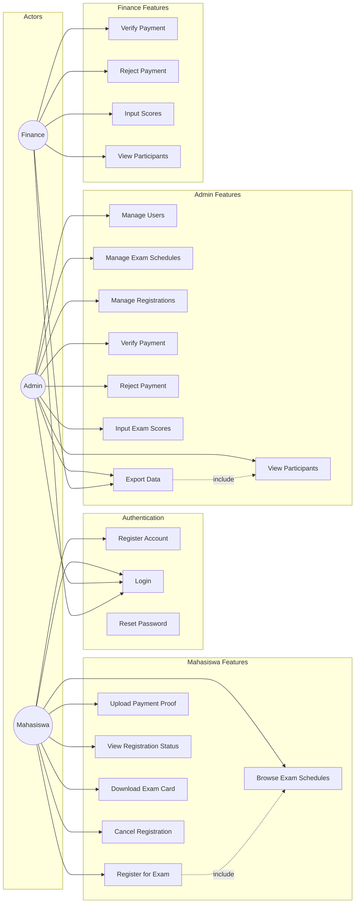
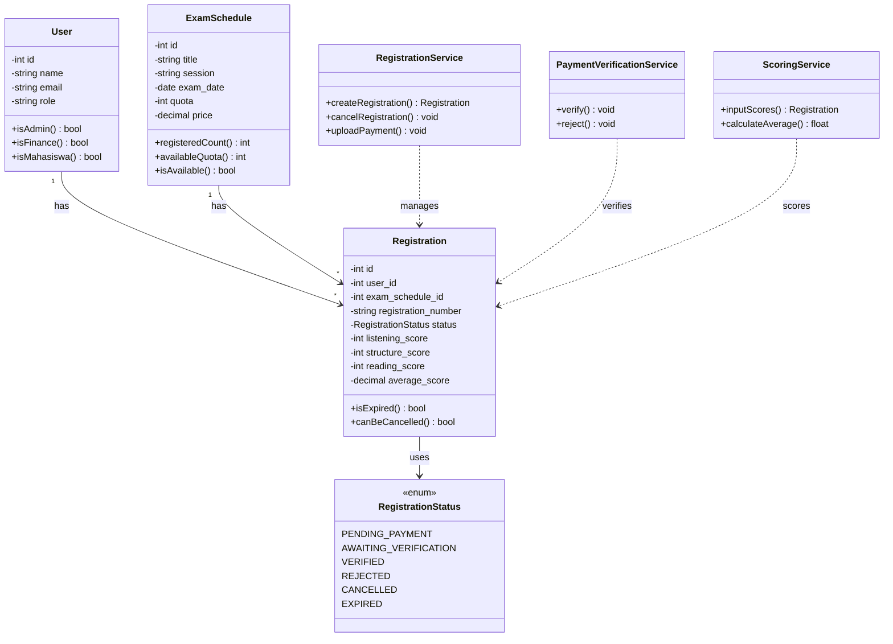
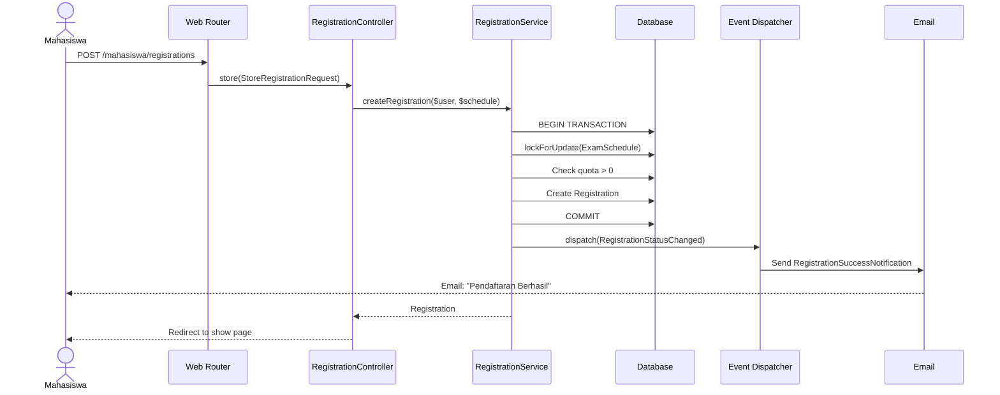
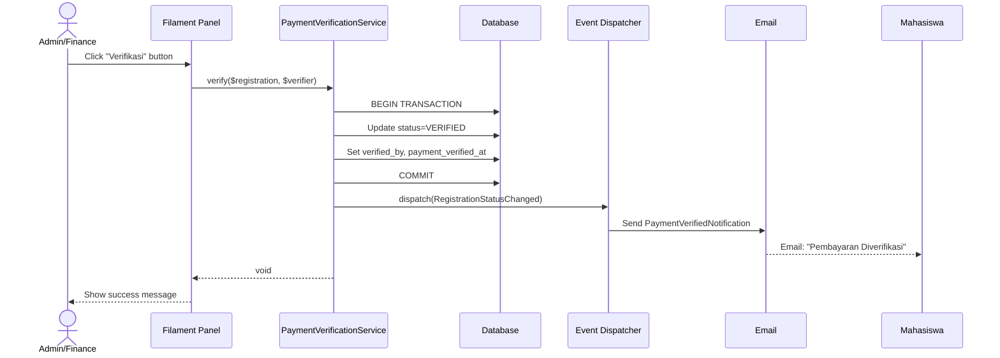
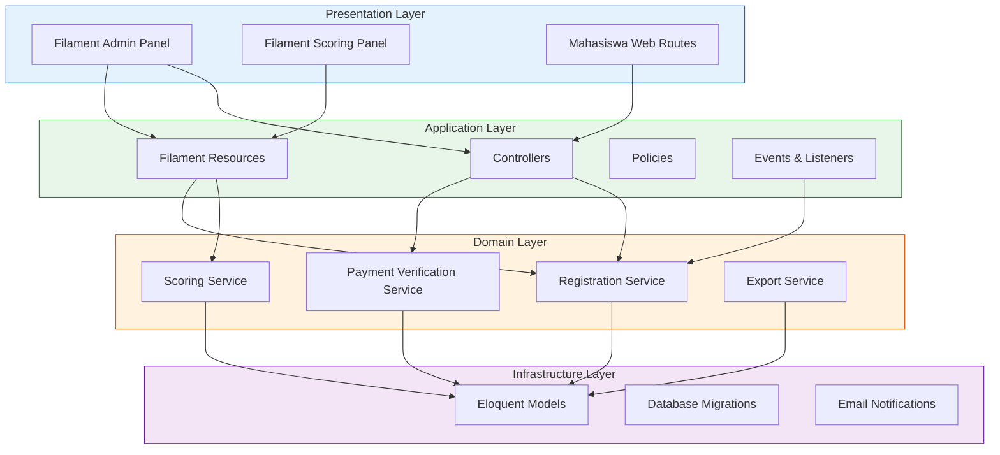
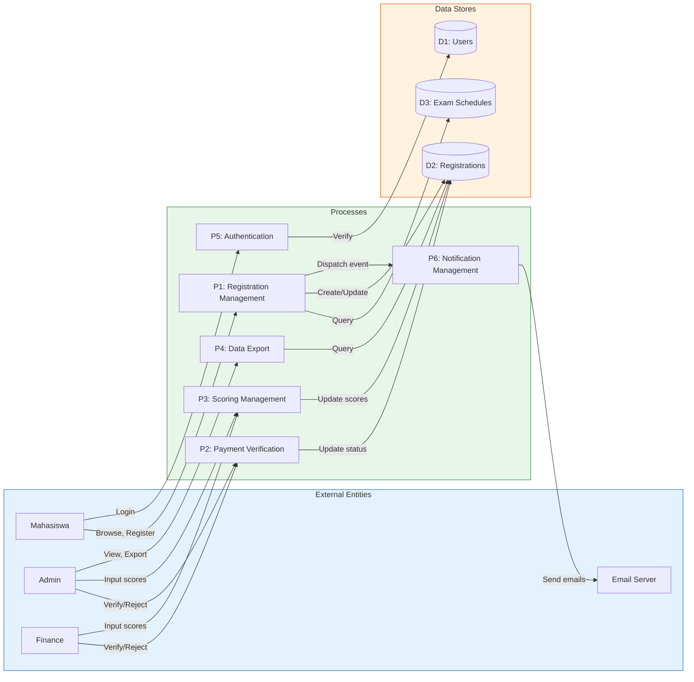

# Aplikasi Pendaftaran English Professional Test (EPT)

Aplikasi web untuk mengelola pendaftaran ujian English Professional Test di lingkungan kampus, dibangun dengan Laravel 12 dan Filament 3.

## Fitur Utama

### 1. Tiga Role Pengguna
- **Mahasiswa** - Mendaftar ujian, upload bukti pembayaran, cek status
- **Admin** - Kelola jadwal ujian, monitor pendaftar, kelola user, input nilai
- **Finance** - Verifikasi pembayaran mahasiswa, input nilai, lihat data

### 2. Modul Mahasiswa (Frontend)
- Registrasi dan login
- Melihat jadwal ujian tersedia dengan informasi kuota real-time
- Pendaftaran ujian dengan validasi (hanya 1 pendaftaran aktif)
- Upload bukti pembayaran (maksimal 24 jam)
- Melihat status pendaftaran dengan countdown timer
- Download kartu ujian (PDF)

### 3. Modul Admin (Filament Panel)
- Kelola jadwal ujian (CRUD)
- Monitor semua pendaftaran
- Filter dan search data
- Export data pendaftar (CSV)
- Manajemen user
- Input nilai ujian

### 4. Modul Keuangan (Filament Panel)
- Dashboard khusus dengan statistik
- Daftar pendaftar menunggu verifikasi
- Verifikasi/tolak pembayaran dengan modal
- Preview bukti transfer
- Riwayat verifikasi
- Input nilai ujian

### 5. Fitur Keamanan & Validasi
- Role-based access control dengan Spatie Permission
- Database transaction dengan locking untuk mencegah race condition
- Validasi batas waktu pembayaran 24 jam
- Scheduler otomatis untuk cek pendaftaran expired
- Soft deletes untuk data penting
- Custom exception handling (RegistrationException, ScoringException)
- Event-driven notifications (RegistrationStatusChanged event)

## Tech Stack

- **Framework**: Laravel 12.x
- **Admin Panel**: Filament 3.x
- **Database**: MySQL
- **Autentikasi**: Laravel Breeze
- **Role Management**: Spatie Laravel Permission
- **Frontend**: Blade + Tailwind CSS + Alpine.js
- **Queue**: Database (default)
- **PDF Export**: DomPDF

## Arsitektur

### Clean Architecture (Layered)
```
app/
├── Constants/          # AppConstants
├── Enums/              # RegistrationStatus
├── Exceptions/         # RegistrationException, ScoringException
├── Events/             # RegistrationStatusChanged
├── Listeners/          # SendRegistrationNotification
├── Filament/
│   ├── Actions/        # VerifyPaymentAction, RejectPaymentAction
│   ├── Columns/        # RegistrationColumns
│   ├── Filters/        # RegistrationFilters
│   ├── Resources/      # RegistrationResource, ScoringResource, etc.
│   └── Pages/          # Participants
├── Http/
│   ├── Controllers/
│   │   ├── Admin/      # Filament controllers
│   │   └── Mahasiswa/  # RegistrationController, DashboardController
│   └── Middleware/      # EnsureAdmin, EnsureMahasiswa
├── Models/             # User, Registration, ExamSchedule
├── Providers/          # AppServiceProvider, Filament AdminPanelProvider
└── Services/           # Business logic services
    ├── RegistrationService.php
    ├── PaymentVerificationService.php
    ├── ScoringService.php
    ├── ExportService.php
    ├── FileStorageService.php
    └── ResponseService.php
```

### Key Design Patterns
- **Service Layer**: Business logic di-services, bukan di-controller
- **Event-Driven**: Status changes dispatch events untuk notifications
- **Policy-Based Authorization**: Gate/Policy untuk akses control
- **Custom Exceptions**: Named constructors untuk error handling
- **Query Scopes**: Reusable query logic di-models

## Instalasi

### 1. Clone Repository
```bash
git clone https://github.com/uctapradema/ept-registration.git
cd ept-registration
```

### 2. Install Dependencies
```bash
composer install
npm install
npm run build
```

### 3. Environment Setup
```bash
cp .env.example .env
php artisan key:generate
```

### 4. Database Setup
```bash
# MySQL
DB_CONNECTION=mysql
DB_HOST=127.0.0.1
DB_PORT=3306
DB_DATABASE=ept
DB_USERNAME=root
DB_PASSWORD=your_password
```

### 5. Migration & Seeding
```bash
php artisan migrate:fresh --seed
```

### 6. Storage Link
```bash
php artisan storage:link
```

### 7. Jalankan Aplikasi
```bash
php artisan serve
```

Akses aplikasi di `http://localhost:8000`

## Akun Default

Setelah seeding, tersedia akun berikut:

| Role | Email | Password |
|------|-------|----------|
| Admin | admin@ept.com | password |
| Finance | finance@ept.com | password |
| Mahasiswa | john@student.com | password |

## Struktur URL

### Frontend (Mahasiswa)
- `/` - Welcome page
- `/login` - Login
- `/register` - Registrasi mahasiswa
- `/dashboard` - Dashboard mahasiswa
- `/schedules` - Lihat jadwal tersedia
- `/registrations/create/{schedule}` - Form pendaftaran
- `/registrations/{registration}` - Detail pendaftaran
- `/registrations/{registration}/payment` - Upload bukti bayar
- `/registrations/{registration}/card` - Download kartu ujian

### Admin Panel (Filament)
- `/admin` - Login admin/finance
- `/admin/exam-schedules` - Kelola jadwal (admin only)
- `/admin/registrations` - Kelola pendaftaran
- `/admin/scoring` - Input nilai (admin/finance)
- `/admin/users` - Kelola user (admin only)
- `/admin/participants` - Lihat data peserta

## Command Penting

### Cek Pendaftaran Expired (Manual)
```bash
php artisan registrations:check-expired
```

Command ini berjalan otomatis setiap jam via scheduler. Untuk menjalankan scheduler secara lokal:
```bash
php artisan schedule:work
```

### Queue Worker
Jika menggunakan queue untuk notifikasi email:
```bash
php artisan queue:work
```

## Business Rules

1. **Satu Pendaftaran Aktif**: Mahasiswa hanya bisa memiliki 1 pendaftaran dengan status aktif (pending_payment, awaiting_verification, atau verified)

2. **Batas Waktu 24 Jam**: Setelah pendaftaran, mahasiswa memiliki waktu 24 jam untuk upload bukti pembayaran

3. **Kuota Terbatas**: Setiap jadwal memiliki kuota terbatas. Sistem menggunakan database locking untuk mencegah overbooking

4. **Verifikasi Manual**: Admin/Finance harus memverifikasi atau menolak pembayaran secara manual

5. **Pengembalian Kuota**: Kuota dikembalikan jika pendaftaran expired atau ditolak

6. **Status Flow**: PENDING_PAYMENT → AWAITING_VERIFICATION → VERIFIED / REJECTED / EXPIRED

## Testing

### Manual Testing Checklist

**Mahasiswa Flow:**
1. Register akun baru
2. Login sebagai mahasiswa
3. Lihat jadwal tersedia
4. Pilih jadwal dan daftar
5. Upload bukti pembayaran
6. Cek status pendaftaran
7. Download kartu ujian

**Admin Flow:**
1. Login ke `/admin` dengan akun admin
2. Buat jadwal ujian baru
3. Edit jadwal
4. Lihat daftar pendaftar
5. Verifikasi pembayaran
6. Input nilai ujian
7. Export data ke CSV

**Finance Flow:**
1. Login ke `/admin` dengan akun finance
2. Lihat dashboard dengan jumlah pending
3. Verifikasi pembayaran mahasiswa
4. Lihat riwayat verifikasi
5. Input nilai ujian

## UML Documentation

Dokumentasi UML tersedia di `docs/uml/`. Berikut diagram-diagram utama:

### Use Case Diagram



### Class Diagram



### Sequence Diagram - Registration Flow



### Sequence Diagram - Payment Verification Flow



### Activity Diagram - Registration Workflow

> **UML Notation:** ● = Initial Node | ◇ = Decision Node | → = Control Flow | [action] = Action Node

```mermaid
flowchart TD
    %% Initial Node
    start((●))

    %% Swimlane: Mahasiswa
    subgraph MH[" "]
        direction TB
        M1[Browse Exam Schedules]
        M2[Select Schedule]
        M3[Fill Registration Form]
        M4[Make Bank Transfer]
        M5[Upload Payment Proof]
        M6[Download Exam Card]
        M7[Attend Exam]
        M8[Re-upload Payment]
    end

    %% Swimlane: System
    subgraph SY[" "]
        direction TB
        S1[Verify Credentials]
        S2[Check Schedule Availability]
        S3[Check Active Registration]
        S4[Generate Registration Number]
        S5[Generate Unique Code]
        S6[Create Registration]
        S7[Validate File Upload]
        S8[Store Payment Proof]
        S9[Update Status to AWAITING_VERIFICATION]
        S10[Check Payment Deadline]
        S11[Update Status to EXPIRED]
        S12[Update Status to VERIFIED]
        S13[Set verified_by and payment_verified_at]
        S14[Update Status to REJECTED]
        S15[Set rejection_reason]
        S16[Validate Scores 0-100]
        S17[Calculate Average Score]
        S18[Save Scores]
        S19[Set graded_by and graded_at]
    end

    %% Swimlane: Admin/Finance
    subgraph AF[" "]
        direction TB
        A1[Review Payment Proof]
        A2[Decide Verify or Reject]
        A3[Enter Rejection Reason]
        A4[Input Exam Scores]
    end

    %% Flow: Initial to Authentication
    start --> S1
    S1 --> D1{Valid?}

    %% Decision: Valid Credentials
    D1 -->|No| E1[Show Error Message]
    D1 -->|Yes| M1

    %% Flow: Browse to Register
    M1 --> M2
    M2 --> S2
    S2 --> D2{Available?}

    %% Decision: Schedule Available
    D2 -->|No| E2[Show Error Message]
    D2 -->|Yes| S3

    %% Check Active Registration
    S3 --> D3{Has Active?}

    %% Decision: Has Active Registration
    D3 -->|Yes| E3[Show Warning Redirect to Existing]
    D3 -->|No| M3

    %% Registration Flow
    M3 --> S4
    S4 --> S5
    S5 --> S6
    S6 --> M4

    %% Payment Upload Flow
    M4 --> M5
    M5 --> S7
    S7 --> D4{Valid File?}

    %% Decision: Valid File
    D4 -->|No| E4[Show Error Message]
    D4 -->|Yes| S8

    S8 --> S9
    S9 --> S10

    %% Check Payment Deadline
    S10 --> D5{Expired?}

    %% Decision: Payment Expired
    D5 -->|Yes| S11
    D5 -->|No| A1

    %% Admin/Finance Verification
    A1 --> A2
    A2 --> D6{Decision?}

    %% Decision: Verify or Reject
    D6 -->|Verify| S12
    D6 -->|Reject| A3

    %% Verified Path
    S12 --> S13
    S13 --> M6
    M6 --> M7
    M7 --> A4

    %% Scoring Flow
    A4 --> S16
    S16 --> D7{Valid Scores?}

    %% Decision: Valid Scores
    D7 -->|No| E5[Show Error Scores out of range]
    D7 -->|Yes| S17

    S17 --> S18
    S18 --> S19
    S19 --> finish((⊙))

    %% Rejected Path
    A3 --> S14
    S14 --> S15
    S15 --> M8
    M8 --> M5

    %% Expired Path
    S11 --> finish2((⊗))

    %% Error Paths
    E1 --> finish3((⊗))
    E2 --> finish4((⊗))
    E3 --> finish5((⊗))
    E4 --> finish6((⊗))
    E5 --> finish7((⊗))

    %% Styling
    style start fill:#000,color:#fff,stroke:#000,stroke-width:4px
    style finish fill:#fff,color:#000,stroke:#000,stroke-width:4px
    style finish2 fill:#fff,color:#000,stroke:#000,stroke-width:4px
    style finish3 fill:#fff,color:#000,stroke:#000,stroke-width:4px
    style finish4 fill:#fff,color:#000,stroke:#000,stroke-width:4px
    style finish5 fill:#fff,color:#000,stroke:#000,stroke-width:4px
    style finish6 fill:#fff,color:#000,stroke:#000,stroke-width:4px
    style finish7 fill:#fff,color:#000,stroke:#000,stroke-width:4px

    style D1 fill:#FFD700,color:#000,stroke:#000
    style D2 fill:#FFD700,color:#000,stroke:#000
    style D3 fill:#FFD700,color:#000,stroke:#000
    style D4 fill:#FFD700,color:#000,stroke:#000
    style D5 fill:#FFD700,color:#000,stroke:#000
    style D6 fill:#FFD700,color:#000,stroke:#000
    style D7 fill:#FFD700,color:#000,stroke:#000

    style MH fill:#E3F2FD,stroke:#1565C0,stroke-width:2px
    style SY fill:#E8F5E9,stroke:#2E7D32,stroke-width:2px
    style AF fill:#FFF3E0,stroke:#E65100,stroke-width:2px
```



### Component Diagram - Architecture



### Data Flow Diagram (DFD)



Lihat `docs/uml/DIAGRAMS.md` untuk versi lengkap semua diagram.

## Development

### Code Quality Standards
- Type hints pada semua parameter
- Return types pada semua method
- Custom exceptions untuk error handling
- Service layer untuk business logic
- Query scopes untuk reusable queries
- Event-driven untuk loose coupling

### Menambahkan Fitur Baru

1. **Model**: Tambahkan di `app/Models/`
2. **Migration**: Buat di `database/migrations/`
3. **Filament Resource**: Generate dengan `php artisan make:filament-resource`
4. **Policy**: Buat di `app/Policies/`
5. **Service**: Buat di `app/Services/`
6. **Routes**: Tambahkan di `routes/web.php`

## Deployment

### Production Checklist
- [ ] Ganti APP_ENV=production
- [ ] Ganti APP_DEBUG=false
- [ ] Setup database production
- [ ] Konfigurasi mail server
- [ ] Setup queue worker (supervisor)
- [ ] Setup cron job untuk scheduler
- [ ] Optimasi: `php artisan optimize`
- [ ] Konfigurasi SSL/HTTPS
- [ ] Jalankan migrations

### Server Requirements
- PHP >= 8.2
- Extensions: BCMath, Ctype, cURL, DOM, Fileinfo, JSON, Mbstring, OpenSSL, PCRE, PDO, Tokenizer, XML
- MySQL >= 5.7
- Composer
- Node.js & NPM (untuk build assets)

## Troubleshooting

### Error: "no such table: roles"
```bash
php artisan vendor:publish --provider="Spatie\Permission\PermissionServiceProvider"
php artisan migrate
```

### Error: "Class not found"
```bash
composer dump-autoload
```

### Permission Denied pada Storage
```bash
chmod -R 775 storage bootstrap/cache
```

### Filament Panel Error
Pastikan middleware dan provider terdaftar dengan benar di `bootstrap/app.php` dan `bootstrap/providers.php`

## License

MIT License

## Kontribusi

Silakan buat Pull Request untuk kontribusi. Pastikan untuk:
1. Fork repository
2. Buat branch fitur (`git checkout -b feature/fitur-baru`)
3. Commit perubahan (`git commit -am 'Add fitur baru'`)
4. Push ke branch (`git push origin feature/fitur-baru`)
5. Buat Pull Request

## Support

Untuk pertanyaan atau issue, silakan buat GitHub Issue.

---

**Dibuat dengan ❤️ menggunakan Laravel 12 & Filament 3**
