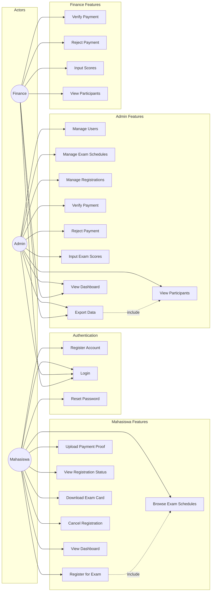
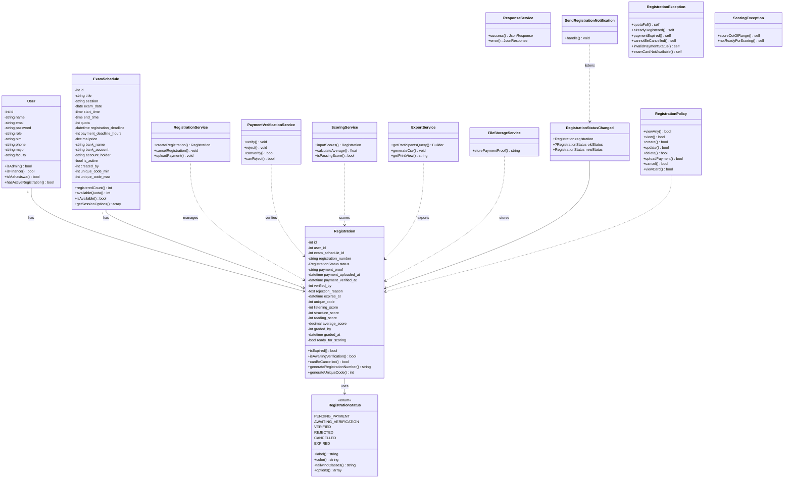
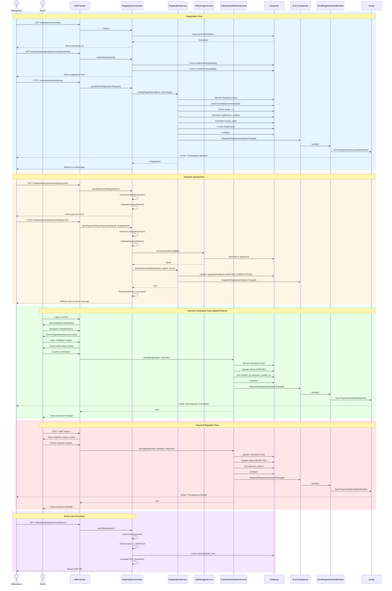
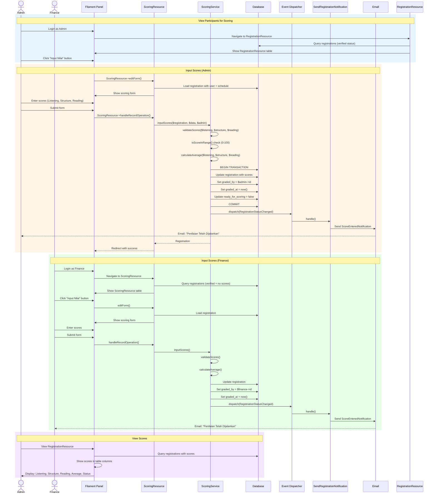
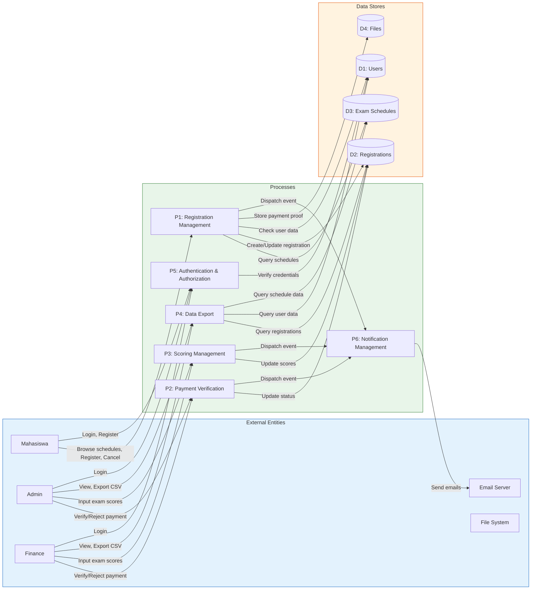

# UML Diagrams - Mermaid.js

Semua diagram dalam format Mermaid.js untuk rendering di GitHub.

---

## 1. Use Case Diagram



---

## 2. Class Diagram



---

## 3. Sequence Diagram - Registration & Payment Flow



---

## 4. Activity Diagram - Registration Workflow

> **UML Notation:** ● = Initial Node | ⊙ = Activity Final Node | ⊗ = Flow Final Node | ◇ = Decision/Merge Node | [] = Action | {} = Guard Condition

```mermaid
flowchart TD
    %% Initial Node
    start((●))

    %% Swimlane: Mahasiswa
    subgraph MH[" "]
        direction TB
        M1[/"Browse Exam Schedules"/]
        M2[/"Select Schedule"/]
        M3[/"Fill Registration Form"/]
        M4[/"Make Bank Transfer"/]
        M5[/"Upload Payment Proof"/]
        M6[/"Download Exam Card"/]
        M7[/"Attend Exam"/]
        M8[/"Re-upload Payment"/]
    end

    %% Swimlane: System
    subgraph SY[" "]
        direction TB
        S1[/"Verify Credentials"/]
        S2[/"Check Schedule Availability"/]
        S3[/"Check Active Registration"/]
        S4[/"Generate Registration Number"/]
        S5[/"Generate Unique Code"/]
        S6[/"Create Registration<br/>(status: PENDING_PAYMENT)"/]
        S7[/"Validate File Upload"/]
        S8[/"Store Payment Proof"/]
        S9[/"Update Status<br/>(status: AWAITING_VERIFICATION)"/]
        S10[/"Check Payment Deadline"/]
        S11[/"Update Status<br/>(status: EXPIRED)"/]
        S12[/"Update Status<br/>(status: VERIFIED)"/]
        S13[/"Set verified_by,<br/>payment_verified_at"/]
        S14[/"Update Status<br/>(status: REJECTED)"/]
        S15[/"Set rejection_reason"/]
        S16[/"Validate Scores<br/>(0-100)"/]
        S17[/"Calculate Average Score"/]
        S18[/"Save Scores"/]
        S19[/"Set graded_by,<br/>graded_at"/]
    end

    %% Swimlane: Admin/Finance
    subgraph AF[" "]
        direction TB
        A1[/"Review Payment Proof"/]
        A2[/"Decide: Verify or Reject"/]
        A3[/"Enter Rejection Reason"/]
        A4[/"Input Exam Scores"/]
    end

    %% Flow: Initial to Authentication
    start --> S1
    S1 -->|{Valid?}| D1{◇}

    %% Decision: Valid Credentials
    D1 -->|No| E1[/"Show Error Message"/]
    D1 -->|Yes| M1

    %% Flow: Browse to Register
    M1 --> M2
    M2 --> S2
    S2 -->|{Available?}| D2{◇}

    %% Decision: Schedule Available
    D2 -->|No| E2[/"Show Error Message"/]
    D2 -->|Yes| S3

    %% Check Active Registration
    S3 -->|{Has Active?}| D3{◇}

    %% Decision: Has Active Registration
    D3 -->|Yes| E3[/"Show Warning:<br/>Redirect to Existing"/]
    D3 -->|No| M3

    %% Registration Flow
    M3 --> S4
    S4 --> S5
    S5 --> S6
    S6 --> M4

    %% Payment Upload Flow
    M4 --> M5
    M5 --> S7
    S7 -->|{Valid File?}| D4{◇}

    %% Decision: Valid File
    D4 -->|No| E4[/"Show Error Message"/]
    D4 -->|Yes| S8

    S8 --> S9
    S9 --> S10

    %% Check Payment Deadline
    S10 -->|{Expired?}| D5{◇}

    %% Decision: Payment Expired
    D5 -->|Yes| S11
    D5 -->|No| A1

    %% Admin/Finance Verification
    A1 --> A2
    A2 -->|{Decision?}| D6{◇}

    %% Decision: Verify or Reject
    D6 -->|Verify| S12
    D6 -->|Reject| A3

    %% Verified Path
    S12 --> S13
    S13 --> M6
    M6 --> M7
    M7 --> A4

    %% Scoring Flow
    A4 --> S16
    S16 -->|{Valid Scores?}| D7{◇}

    %% Decision: Valid Scores
    D7 -->|No| E5[/"Show Error:<br/>Scores out of range"/]
    D7 -->|Yes| S17

    S17 --> S18
    S18 --> S19
    S19 --> finish((⊙))

    %% Rejected Path
    A3 --> S14
    S14 --> S15
    S15 --> M8
    M8 --> M5

    %% Expired Path
    S11 --> finish2((⊗))

    %% Error Paths
    E1 --> finish3((⊗))
    E2 --> finish4((⊗))
    E3 --> finish5((⊗))
    E4 --> finish6((⊗))
    E5 --> finish7((⊗))

    %% Styling
    style start fill:#000,color:#fff,stroke:#000,stroke-width:4px
    style finish fill:#fff,color:#000,stroke:#000,stroke-width:4px
    style finish2 fill:#fff,color:#000,stroke:#000,stroke-width:4px
    style finish3 fill:#fff,color:#000,stroke:#000,stroke-width:4px
    style finish4 fill:#fff,color:#000,stroke:#000,stroke-width:4px
    style finish5 fill:#fff,color:#000,stroke:#000,stroke-width:4px
    style finish6 fill:#fff,color:#000,stroke:#000,stroke-width:4px
    style finish7 fill:#fff,color:#000,stroke:#000,stroke-width:4px

    style D1 fill:#FFD700,color:#000,stroke:#000
    style D2 fill:#FFD700,color:#000,stroke:#000
    style D3 fill:#FFD700,color:#000,stroke:#000
    style D4 fill:#FFD700,color:#000,stroke:#000
    style D5 fill:#FFD700,color:#000,stroke:#000
    style D6 fill:#FFD700,color:#000,stroke:#000
    style D7 fill:#FFD700,color:#000,stroke:#000

    style MH fill:#E3F2FD,stroke:#1565C0,stroke-width:2px
    style SY fill:#E8F5E9,stroke:#2E7D32,stroke-width:2px
    style AF fill:#FFF3E0,stroke:#E65100,stroke-width:2px
```

---

## 5. Sequence Diagram - Scoring Flow



---

## 6. Component Diagram - Architecture

```mermaid
graph TD
    subgraph Presentation["Presentation Layer"]
        AdminPanel["Filament Admin Panel"]
        ScoringPanel["Filament Scoring Panel"]
        MahasiswaWeb["Mahasiswa Web Routes"]
        PDFExport["PDF Export (DomPDF)"]
    end

    subgraph Application["Application Layer"]
        Controllers["Controllers"]
        FilamentRes["Filament Resources"]
        FormReq["Form Requests"]
        Policies["Policies"]
        Middleware["Middleware"]
        EventsListeners["Events & Listeners"]
        Exceptions["Exceptions"]
    end

    subgraph Domain["Domain Layer"]
        RegService["Registration Service"]
        PayService["Payment Verification Service"]
        ScoreService["Scoring Service"]
        ExportService["Export Service"]
        FileService["File Storage Service"]
        ResService["Response Service"]
    end

    subgraph Infrastructure["Infrastructure Layer"]
        EloquentModels["Eloquent Models"]
        Migrations["Database Migrations"]
        EmailNotif["Email Notifications"]
        FileStorage["File Storage"]
    end

    subgraph External["External Dependencies"]
        Laravel["Laravel Framework"]
        FilamentPHP["Filament PHP"]
        SpatiePerm["Spatie Permission"]
        DomPDFLib["DomPDF"]
        Tailwind["Tailwind CSS"]
    end

    AdminPanel --> Controllers
    AdminPanel --> FilamentRes
    ScoringPanel --> FilamentRes
    MahasiswaWeb --> Controllers
    MahasiswaWeb --> FormReq

    Controllers --> RegService
    Controllers --> PayService
    Controllers --> ExportService
    FilamentRes --> ScoreService
    FilamentRes --> RegService
    FilamentRes --> PayService
    EventsListeners --> RegService
    EventsListeners --> PayService

    RegService --> EloquentModels
    PayService --> EloquentModels
    ScoreService --> EloquentModels
    ExportService --> EloquentModels
    FileService --> FileStorage
    EmailNotif --> Laravel

    EloquentModels --> Laravel
    FilamentRes --> FilamentPHP
    FormReq --> Laravel
    Policies --> SpatiePerm
    PDFExport --> DomPDFLib

    Middleware --> Policies
    Policies --> EloquentModels

    style Presentation fill:#E3F2FD,stroke:#1565C0
    style Application fill:#E8F5E9,stroke:#2E7D32
    style Domain fill:#FFF3E0,stroke:#E65100
    style Infrastructure fill:#F3E5F5,stroke:#6A1B9A
    style External fill:#ECEFF1,stroke:#546E6A
```



---

## 7. Data Flow Diagram (DFD) Level 1


