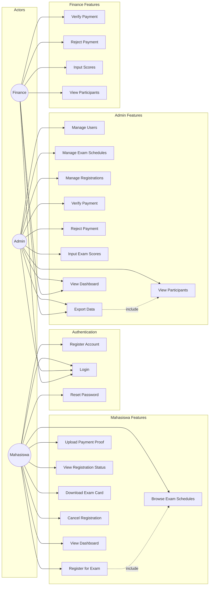
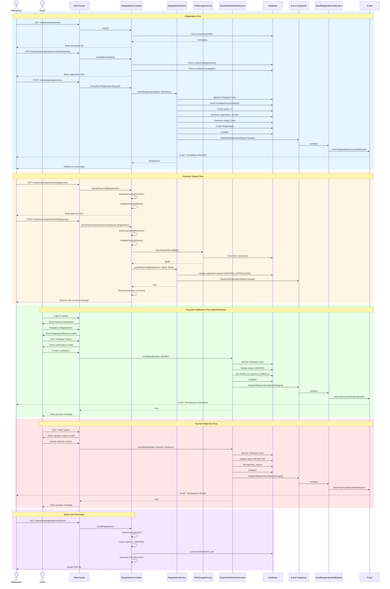
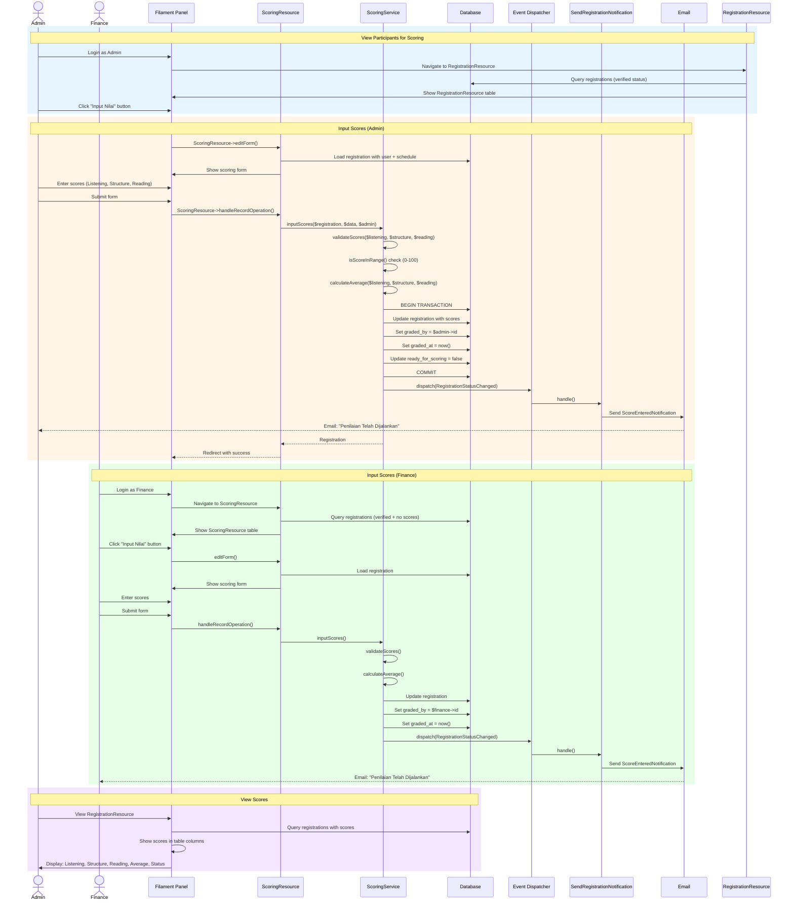
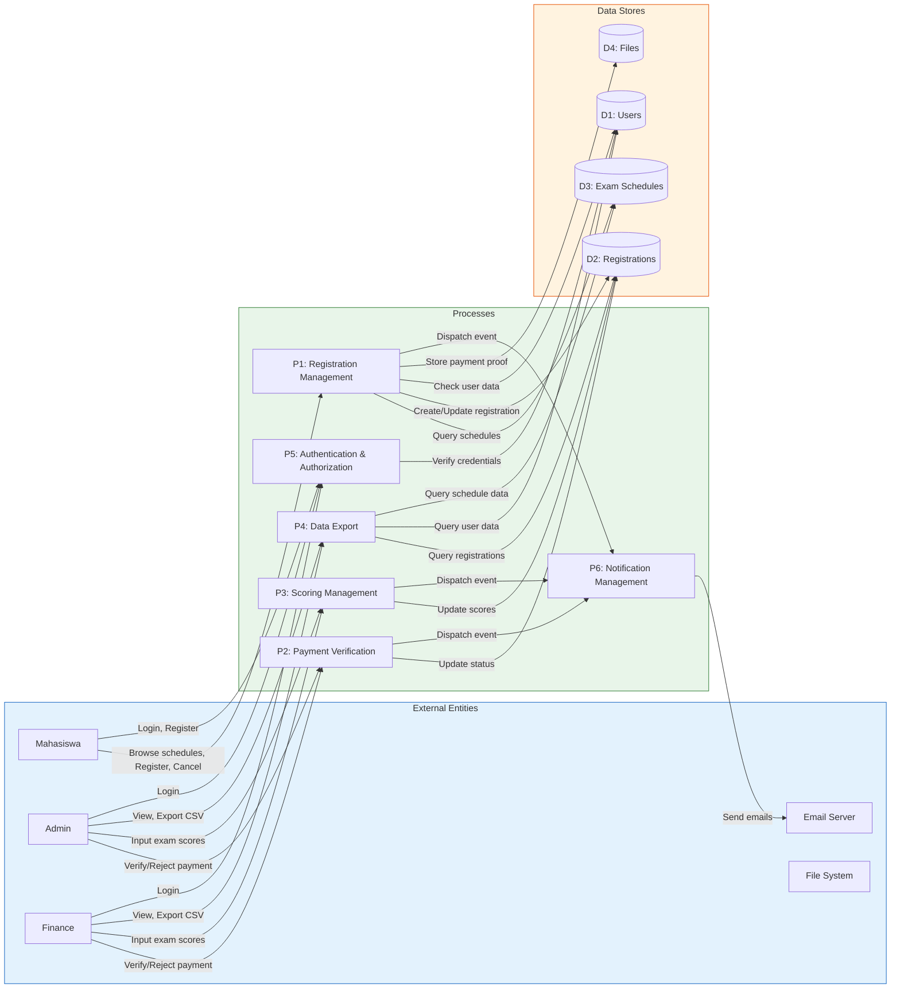

# UML Diagrams - Mermaid.js

Semua diagram dalam format Mermaid.js untuk rendering di GitHub.

---

## 1. Use Case Diagram

---

## 2. Class Diagram

---

## 3. Sequence Diagram - Registration & Payment Flow

---

## 4. Activity Diagram - Registration Workflow

```mermaid
flowchart TD
    Start((Start)) --> M_Open[Mahasiswa: Open EPT Website]
    M_Open --> M_Login[Mahasiswa: Login with credentials]

    M_Login --> S_Verify[System: Verify credentials]
    S_Verify -->|Invalid| S_Error[System: Show error message]
    S_Error --> Stop1((Stop))
    S_Verify -->|Valid| S_Session[System: Create session]

    S_Session --> M_Dash[Mahasiswa: View Dashboard]
    M_Dash --> M_Browse[Mahasiswa: Browse Exam Schedules]

    M_Browse --> S_Query[System: Query active schedules]
    S_Query --> S_CheckDead[System: Check registration deadline]
    S_CheckDead --> S_CheckQuota[System: Check available quota]

    S_CheckQuota --> M_Select[Mahasiswa: Select schedule]
    M_Select --> M_Click[Mahasiswa: Click Register]

    M_Click --> S_CheckActive[System: Check if user has active registration]
    S_CheckActive -->|Has active| S_Warn[System: Show warning message]
    S_Warn --> Stop2((Stop))
    S_CheckActive -->|No active| S_CheckAvail[System: Check schedule availability]

    S_CheckAvail -->|Not available| S_ErrorMsg[System: Show error message]
    S_ErrorMsg --> Stop3((Stop))
    S_CheckAvail -->|Available| S_GenRegNum[System: Generate registration number]
    S_GenRegNum --> S_GenCode[System: Generate unique code]
    S_GenCode --> S_CreateReg[System: Create registration]
    S_CreateReg --> S_SetDeadline[System: Set payment deadline]
    S_SetDeadline --> S_Dispatch1[System: Dispatch RegistrationStatusChanged event]
    S_Dispatch1 --> S_SendEmail1[System: Send RegistrationSuccessNotification email]

    S_SendEmail1 --> M_ViewReg[Mahasiswa: View registration details]
    M_ViewReg --> M_Note[Mahasiswa: Note unique code and total payment]
    M_Note --> M_Transfer[Mahasiswa: Make bank transfer]

    M_Transfer --> M_Upload[Mahasiswa: Upload payment proof]
    M_Upload --> M_AddNote[Mahasiswa: Add payment note optional]
    M_AddNote --> S_Validate[System: Validate file upload]
    S_Validate --> S_StoreFile[System: Store payment proof file]
    S_StoreFile --> S_UpdateStatus1[System: Update registration]
    S_UpdateStatus1 --> S_Dispatch2[System: Dispatch RegistrationStatusChanged event]

    S_Dispatch2 --> A_View[Admin/Finance: View RegistrationResource table]
    A_View --> A_Review[Admin/Finance: Review payment proof]
    A_Review --> A_Click[Admin/Finance: Click Verifikasi or Tolak]

    A_Click -->|Verify| S_UpdateVerified[System: Update status to VERIFIED]
    S_UpdateVerified --> S_SetVerified[System: Set verified_by, payment_verified_at]
    S_SetVerified --> S_Dispatch3[System: Dispatch event]
    S_Dispatch3 --> S_SendEmail2[System: Send PaymentVerifiedNotification email]

    S_SendEmail2 --> M_ReceiveOK[Mahasiswa: Receive verification email]
    M_ReceiveOK --> M_Download[Mahasiswa: Download Exam Card PDF]
    M_Download --> M_Attend[Mahasiswa: Attend exam]

    M_Attend --> A_Score[Admin/Finance: Input exam scores]
    A_Score --> S_ValidateScore[System: Validate scores 0-100]
    S_ValidateScore --> S_CalcAvg[System: Calculate average score]
    S_CalcAvg --> S_UpdateScores[System: Update registration with scores]
    S_UpdateScores --> S_SetGraded[System: Set graded_by, graded_at]

    A_Click -->|Reject| A_Reason[Admin/Finance: Enter rejection reason]
    A_Reason --> S_UpdateRejected[System: Update status to REJECTED]
    S_UpdateRejected --> S_SetReason[System: Set rejection_reason]
    S_SetReason --> S_Dispatch4[System: Dispatch event]
    S_Dispatch4 --> S_SendEmail3[System: Send PaymentRejectedNotification email]
    S_SendEmail3 --> M_ReceiveReject[Mahasiswa: Receive rejection email]
    M_ReceiveReject --> M_ReUpload[Mahasiswa: Re-upload payment proof]
    M_ReUpload --> M_Upload

    S_SetGraded --> S_CheckExpired[System: Check expired registrations hourly]
    S_CheckExpired -->|Deadline passed| S_UpdateExpired[System: Update status to EXPIRED]
    S_UpdateExpired --> S_Dispatch5[System: Dispatch event]
    S_Dispatch5 --> Stop4((Stop))
    S_CheckExpired -->|Not expired| Stop5((Stop))

    style Start fill:#4CAF50,color:#fff
    style Stop1 fill:#f44336,color:#fff
    style Stop2 fill:#f44336,color:#fff
    style Stop3 fill:#f44336,color:#fff
    style Stop4 fill:#2196F3,color:#fff
    style Stop5 fill:#2196F3,color:#fff
```

---

## 5. Sequence Diagram - Scoring Flow

---

## 6. Component Diagram - Architecture

```mermaid
graph TD
    subgraph Presentation["Presentation Layer"]
        AdminPanel["Filament Admin Panel"]
        ScoringPanel["Filament Scoring Panel"]
        MahasiswaWeb["Mahasiswa Web Routes"]
        PDFExport["PDF Export (DomPDF)"]
    end

    subgraph Application["Application Layer"]
        Controllers["Controllers"]
        FilamentRes["Filament Resources"]
        FormReq["Form Requests"]
        Policies["Policies"]
        Middleware["Middleware"]
        EventsListeners["Events & Listeners"]
        Exceptions["Exceptions"]
    end

    subgraph Domain["Domain Layer"]
        RegService["Registration Service"]
        PayService["Payment Verification Service"]
        ScoreService["Scoring Service"]
        ExportService["Export Service"]
        FileService["File Storage Service"]
        ResService["Response Service"]
    end

    subgraph Infrastructure["Infrastructure Layer"]
        EloquentModels["Eloquent Models"]
        Migrations["Database Migrations"]
        EmailNotif["Email Notifications"]
        FileStorage["File Storage"]
    end

    subgraph External["External Dependencies"]
        Laravel["Laravel Framework"]
        FilamentPHP["Filament PHP"]
        SpatiePerm["Spatie Permission"]
        DomPDFLib["DomPDF"]
        Tailwind["Tailwind CSS"]
    end

    AdminPanel --> Controllers
    AdminPanel --> FilamentRes
    ScoringPanel --> FilamentRes
    MahasiswaWeb --> Controllers
    MahasiswaWeb --> FormReq

    Controllers --> RegService
    Controllers --> PayService
    Controllers --> ExportService
    FilamentRes --> ScoreService
    FilamentRes --> RegService
    FilamentRes --> PayService
    EventsListeners --> RegService
    EventsListeners --> PayService

    RegService --> EloquentModels
    PayService --> EloquentModels
    ScoreService --> EloquentModels
    ExportService --> EloquentModels
    FileService --> FileStorage
    EmailNotif --> Laravel

    EloquentModels --> Laravel
    FilamentRes --> FilamentPHP
    FormReq --> Laravel
    Policies --> SpatiePerm
    PDFExport --> DomPDFLib

    Middleware --> Policies
    Policies --> EloquentModels

    style Presentation fill:#E3F2FD,stroke:#1565C0
    style Application fill:#E8F5E9,stroke:#2E7D32
    style Domain fill:#FFF3E0,stroke:#E65100
    style Infrastructure fill:#F3E5F5,stroke:#6A1B9A
    style External fill:#ECEFF1,stroke:#546E6A
```

---

## 7. Data Flow Diagram (DFD) Level 1

